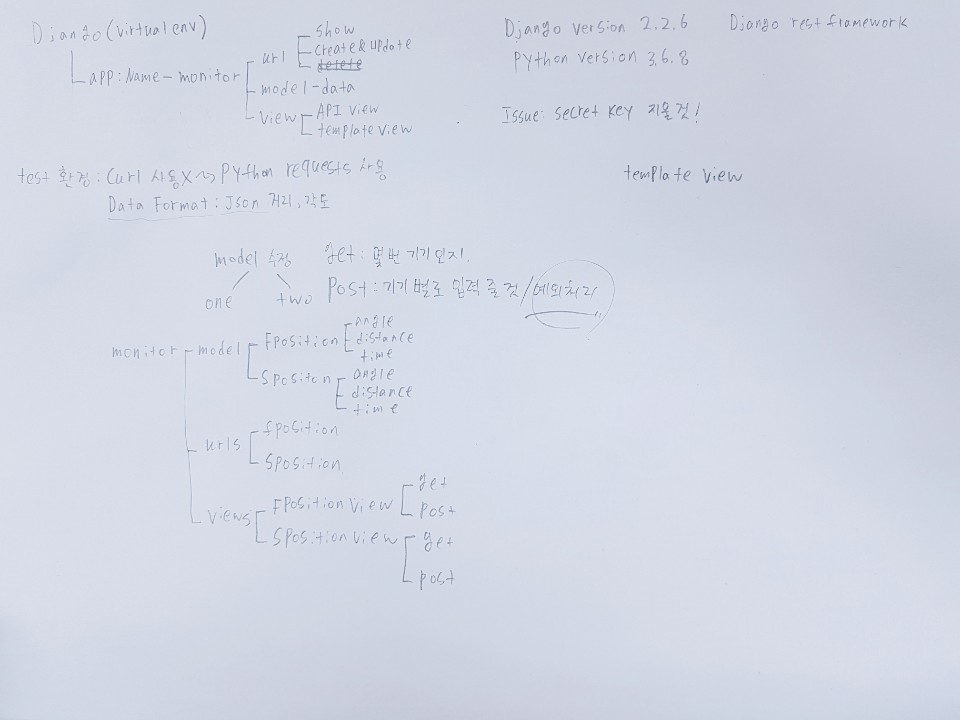
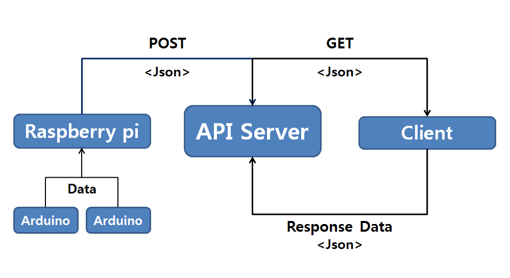
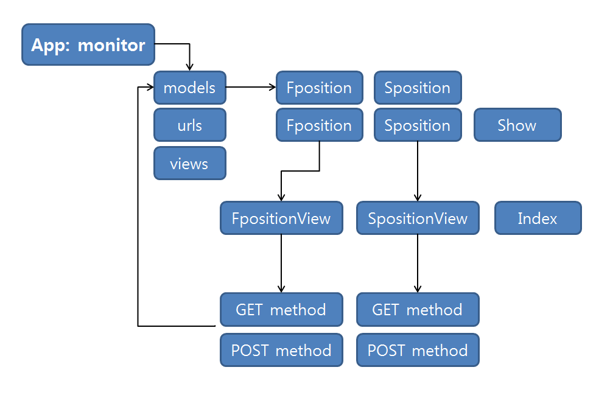
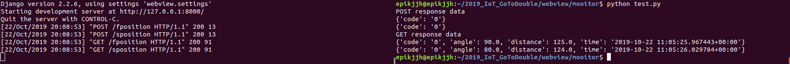

<h1> Brain storming </h1>  
일단 API 서버를 구축하기 위하여 생각을 정리하여 보았습니다.<br><br>



<h1> Block diagram </h1>  
생각을 정리한 후 Block diagram을 그려서 개발 목적 및 방향을 구체화 하였습니다.<br><br>

  

<h1> 개발 환경 </h1>
<h3> Python 3.6.8 </h3>
<h3> Django 2.2.6 (Virtual environment) </h3>
<h3> Django rest framework 3.10.3 (Virtual environment) </h3>

<h1> API Server 구조 </h1>



<h1> Test 결과 </h1>
Test 코드는 python을 이용하여 작성하였습니다.<br>
<h3> Test code </h3>

```python
import requests,json

furl = "http://127.0.0.1:8000/fposition"
surl = "http://127.0.0.1:8000/sposition"
dummy_fdata = {"angle": "90.0", "distance":"125.0"}
dummy_sdata = {"angle": "80.0", "distance":"124.0"}
fpost = requests.post(url=furl,data=dummy_fdata)
spost = requests.post(url=surl,data=dummy_sdata)
print("POST response data")
print(fpost.json())
print(spost.json())
fget = requests.get(url=furl)
sget = requests.get(url=surl)
print("GET response data")
print(fget.json())
print(sget.json())
```

